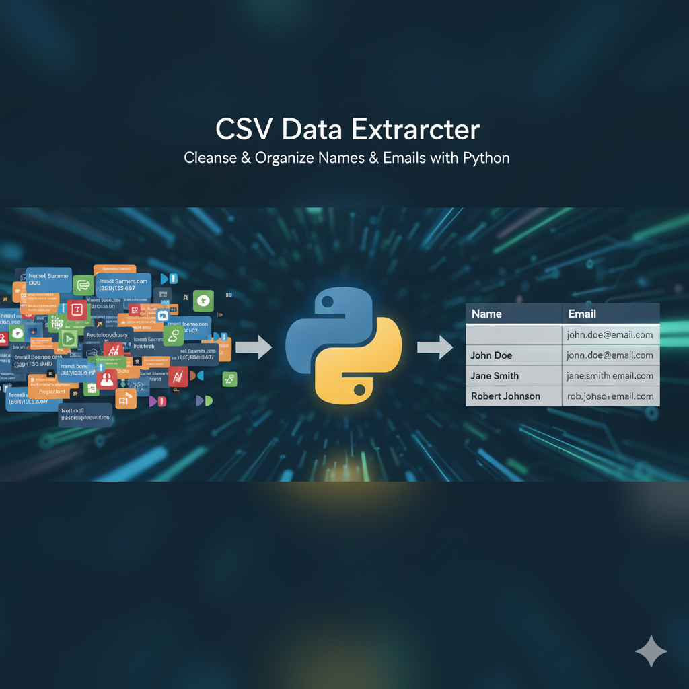

# CSV Name-Email Extractor



A Python tool to extract names and email addresses from CSV files and format them into a clean two-column CSV structure.

## Features

- Accepts any CSV filename as input
- Combines first and last names into a single "Name" column
- Extracts email addresses into a separate "Email" column
- Robust parsing that handles various name formats
- Error handling for file not found scenarios
- Simple and intuitive user interface

## Requirements

- Python 3.x
- No external dependencies required (uses standard libraries only)

## Usage

1. Ensure you have Python 3 installed on your system.

2. Place the `csv_cleaner.py` script in the same directory as your input CSV file.

3. Run the script using the command line:

   ```bash
   python3 csv_cleaner.py
   ```

4. When prompted, enter the name of your input CSV file (including the .csv extension).

5. The script will process your file and generate an `output.csv` file with the cleaned data.

## Input File Format

The tool expects input CSV files with lines formatted like this:

```
First Last email@example.com
First Middle Last email@example.com
```

The tool will intelligently identify email addresses and extract names accordingly.

## Output Format

The generated `output.csv` file will have two columns:

```
Name,Email
First Last,email@example.com
First Middle Last,email@example.com
```

## Error Handling

- If you specify a file that doesn't exist, the tool will prompt you to try again
- Handles cases where email addresses might not be present
- Gracefully processes empty lines in the input file

## Example

Input (sample.csv):
```
John Doe john.doe@example.com
Jane Smith jane.smith@company.org
```

Output (output.csv):
```
Name,Email
John Doe,john.doe@example.com
Jane Smith,jane.smith@company.org
```

## .gitignore

The project includes a `.gitignore` file that excludes the `output.csv` file to prevent generated files from being tracked in version control.

## License

This tool is provided as-is without any warranty. You are free to modify and distribute it for personal or commercial use.

## System Compatibility

This tool has been tested on macOS (Arm M1) and is designed to work on all major operating systems that support Python 3.